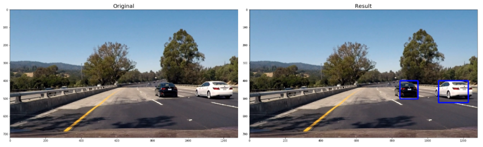

# Dự án 03: Bài toán nhận diện xe với HOG và SVM

### Tên mã: vehicle-detection-with-hog-n-svm

---

Ở [tutorial 01: Xây dựng Raspberry PI thành máy tính cho Data Scientist (PIDS)](https://github.com/mechasolution-vn/machine-learning-on-pi-with-tensorflow), chúng ta đã được tìm hiểu cách để biến Raspberry PI thành một máy tính cho Data Scientist. Tiếp tục, trong _Tutorial PI ❤ AI_, chúng ta sẽ cùng nhua tạo thiết bị nhận dạng xe ôtô với Raspberry PI nhé !



## Tổng quan

Có rất nhiều thuật toán để giải quyết bài toán Vehicle detection. Trong bài này, chúng ta sẽ giải quyết bài toán này với các kĩ thuật trong Machine learning và Computer Vision như sau:

- Linear SVM
- Rút trích đặc trưng HOG(Histogram of Oriented Gradients)
- Color space conversion
- Space binning
- Histogram of color extraction
- Sliding Window

## Lưu ý

Đầu tiên, bạn cần huấn luyện (training) tập dữ liệu của bạn (cars and not-cars). Bạn có thể download dữ liệu tại [GTI vehicle image database](http://www.gti.ssr.upm.es/data/Vehicle_database.html) hoặc giải 2 files nén trong thư mục*training-data* của project này. Mỗi lớp dữ liệu có từ 1500 hình trở lên sẽ tốt cho quá trình huấn luyện.

## Dependencies

- Python >= 3.4

## Cài đặt môi trường

```
pip install -r requirements.txt
```

## Chạy jupyter notebook

Bạn truy cập vào thư mục chính của Project và chạy Jupyter notebook để bắt đầu tìm hiểu project.

```
jupyter notebook
```

## Chạy project với file Python riêng biệt

Nếu bạn đã hiểu project thông qua Jupyter notebook, bạn hãy truy cập thư mục _only-python-code_ để bắt đầu chạy project (training và testing) với python mà không cần Jupyter notebook nữa. Rất phù hợp cho việc áp dụng vào thực tế

[Mechasolution Việt Nam](https://mechasolution.vn)
